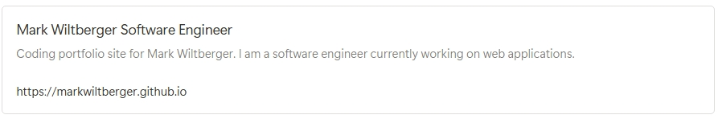

## Hi there, I'm Mark 👋

### I'm a Software Engineer with expertise in

- TypeScript
- JavaScript
- Vue.js
- Node.js
- Nest.js
- and other backend and frontend web application frameworks

My current interests are writing backend and frontend for full-stack web apps and creating code that is maintainable, scalable, and testable.

### Portfolio Website:

My portfolio is written up in detail on my portfolio website:

<a href="https://markwiltberger.github.io" style="display: block; text-align: center; font-weight: bold;">markwiltberger.github.io</a>

 

### The code here on GitHub for some of my portfolio projects are:

- [realtor-app repository](https://github.com/MarkWiltberger/vue-nest-web-app__realtor-app) - A Node.js/Nest.js backend for a mock realtor search website to search and create realty listings
- [careers-search repository](https://github.com/MarkWiltberger/careers-search) - a Vue.js frontend for a mock career search website to search and filter job listings. A Work in Progress.
- [markwiltberger.github.io repository](https://github.com/MarkWiltberger/markwiltberger.github.io) - my bio and portfolio website, built right here on GitHub using GitHub Pages.

### Profile and Contact Information:

- **My portfolio website:** <a href="https://markwiltberger.github.io" target="_blank">markwiltberger.github.io</a>
- **My LinkedIn Profile:** <a href="https://www.linkedin.com/in/markwiltberger/" target="_blank">Mark Wiltberger on LinkedIn</a>
- **email**: mark.wiltberger@gmail.com
- **LinkedIn**: MarkWiltberger

 

[]

